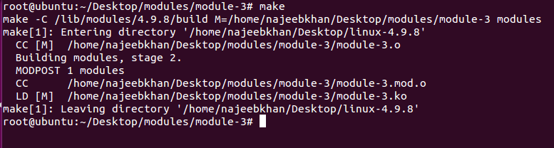
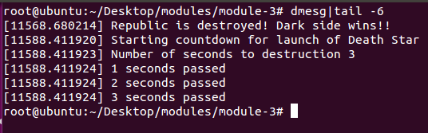

# Linux Kernel Modules

The Linux Kernel Modules were part of the presentation for CEN-605, Linux Utility Lab. The presentation for the same can be found on the link below
[Link to the Presentation](https://docs.google.com/presentation/d/18c2DXre7kah3m2rbNXBJSBmu_C4XnLfwYwOxrpAAwjw/edit?usp=sharing)

## About Linux Kernel Module

If you want to add code to a Linux kernel, the most basic way to do that is to add some source files to the kernel source tree and recompile the kernel. In fact, the kernel configuration process consists mainly of choosing which files to include in the kernel to be compiled.

But you can also add code to the Linux kernel while it is running. A chunk of code that you add in this way is called a loadable kernel module. These modules can do lots of things, but they typically are one of three things: 
* device drivers 
* filesystem drivers
* system calls. 
The kernel isolates certain functions, including these, especially well so they don't have to be intricately wired into the rest of the kernel.
LKMs did not exist in Linux in the beginning. Anything we use an LKM for today was built into the base kernel at kernel build time instead. LKMs have been around at least since Linux 1.2 (1995).

Device drivers and such were always quite modular, though. When LKMs were invented, only a small amount of work was needed on these modules to make them buildable as LKMs. However, it had to be done on each and every one, so it took some time. Since about 2000, virtually everything that makes sense as an LKM has at least had the option of being an LKM.

## Setting up the system
Before writing your own custom loadable kernel modules, run the following commands to download any prerequisites (if any)

```
sudo apt-get update
```

```
apt-cache search linux-headers-$(uname -r)
```

```
sudo apt-get install linux-headers-3.16.0-4-amd64
```

## Executing a Linux Kernel Module

Make sure that the Makefile is ready for the kernel module

Run the following command

```
make
```

Insert the loadable kernel module into the kernel

```
sudo insmod <module_name>.ko
```

Check whether the kernel is successfully inserted

```
lsmod
```

The above command will output the name of recent modules that are present as part of the kernel

Following command can be used to get information about the kernel module

```
modinfo <module_name>.ko
```

Output of the kernel module can be seen in the kernel log file

```
sudo su -
cd /var/log
tail -f kern.log
```
## Example images of compilation procedure

### Compilation


### Output


## Author Information
* **Najeeb Khan** - [najeeb97khan](http://github.com/najeeb97khan)

## Special Thanks to
* http://derekmolloy.ie/writing-a-linux-kernel-module-part-1-introduction/
* http://www.tldp.org/HOWTO/Module-HOWTO/x73.html
* Linux Utility Lab